

  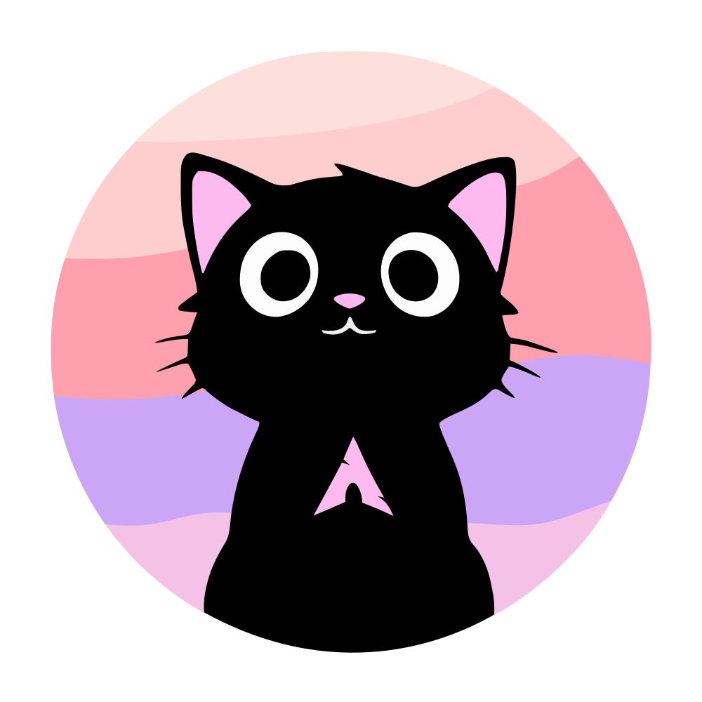

  # Meowrch Branding Assets
  
  *The visual identity of the most innovative Arch-based distribution.*
  
  

## 🐈 About This Repository

This repository serves as the single source of truth for all **Meowrch** visual and media assets. Whether you are building a community spin, creating content, or just rice-ing your Linux desktop, you'll find everything you need right here.

## 📂 Repository Structure

| Directory | Content Description | Formats |
|:---|:---|:---|
| `📂 avatar` | Profile pictures and social media icons | `.png`, `.psd` |
| `📂 logo` | Official Meowrch logos (Main identity) | `.png`, `.svg` |
| `📂 promo` | Marketing materials, YouTube thumbnails, and audio | `.psd`, `.png`, `.mp3` |
| `📂 stickers` | Official Meowrch sticker pack for Telegram/Discord | `.png` |

---

## 🎨 Official Sticker Pack

A collection of emotions for every Linux user — from the pain of a broken dependency to the glory of a successful install.

| | | | |
|:---:|:---:|:---:|:---:|
| 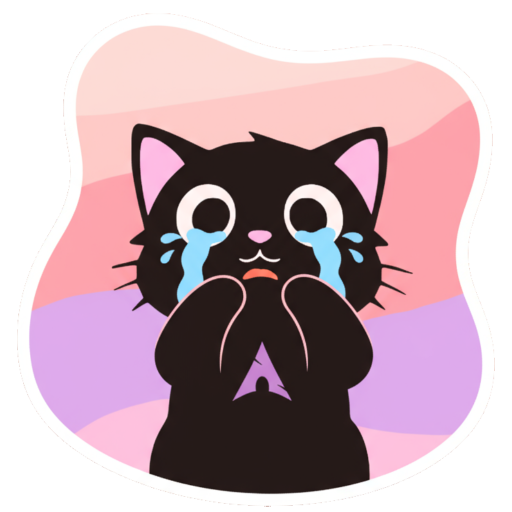 `😭 cry` | 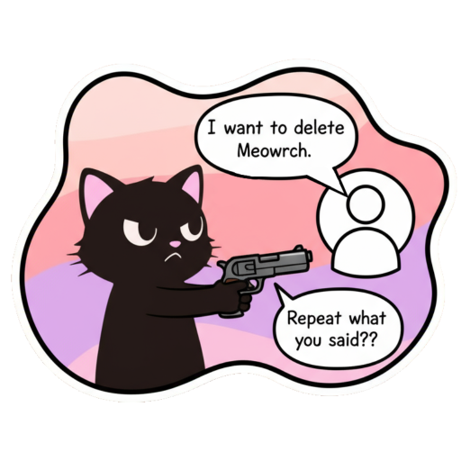 `😡 delete_meowrch` | 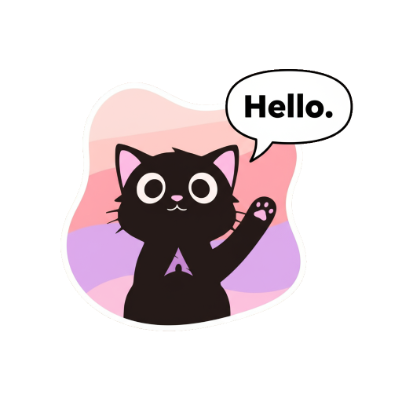 `👋 hello` | 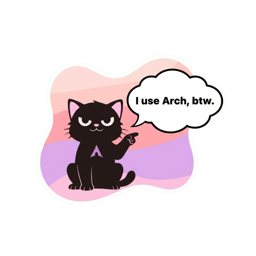 `😎 i_use_arch_btw` |
| 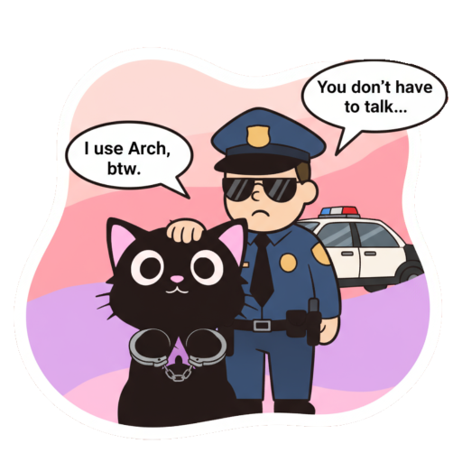 `🤓 policeman` | 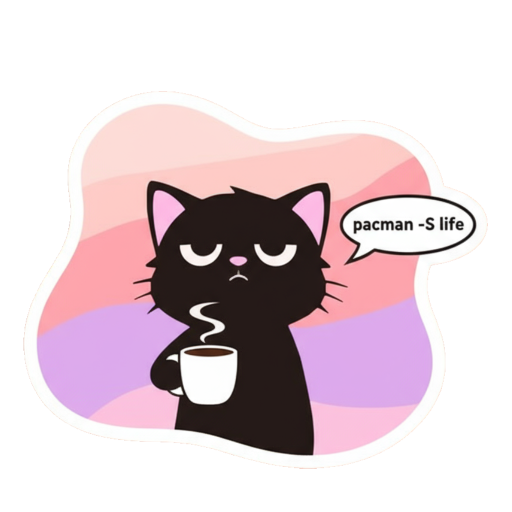 `😴 install_life` | 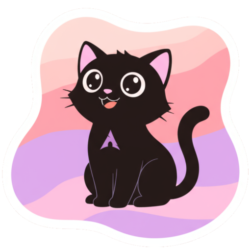 `😄 joyful` | 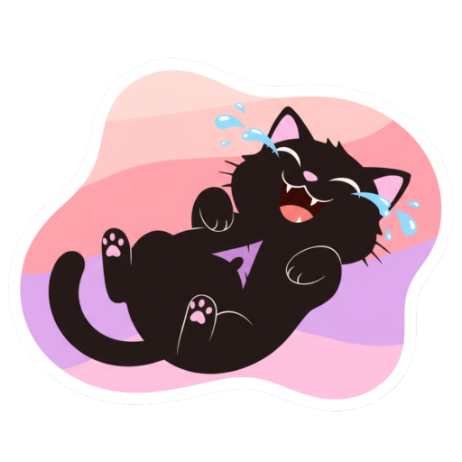 `😂 laugh` |
| 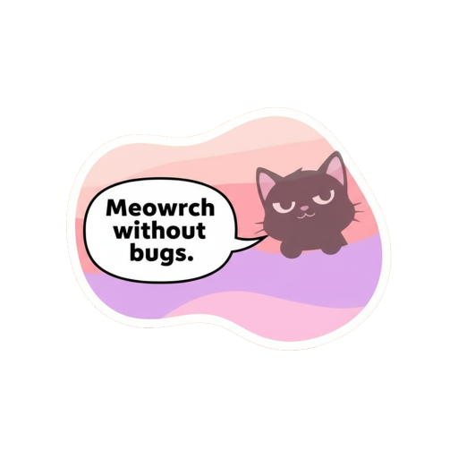 `🤫 no_bugs` | 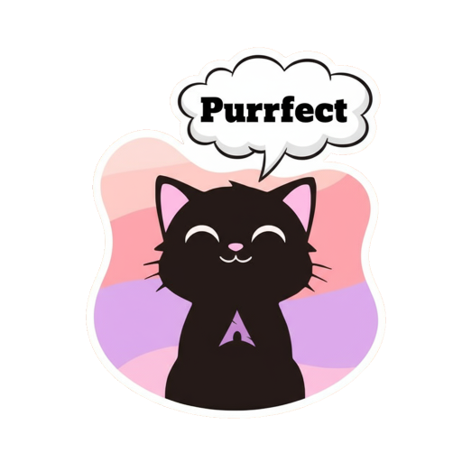 `😌 purrfect` | 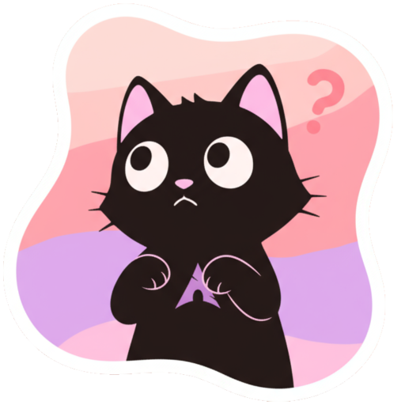 `🤨 question` | 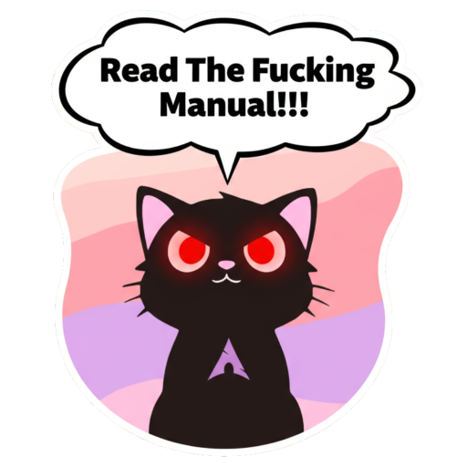 `🤬 RTFM` |
| 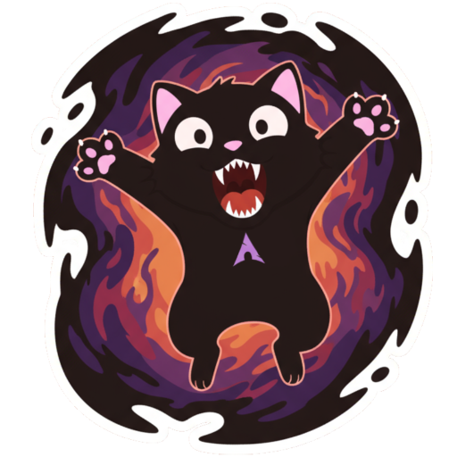 `👹 scare` | | | |

### 🔗 Links:
- [Telegram Sticker Pack](https://t.me/addstickers/meowrch_rice)

## 🖼️ Media & Promo

The `/promo` folder contains media materials used on social networks and blogs. For example, music and previews for YouTube videos.

## 🛠 Recommendations for use

1. **Scalability:** For high-resolution printing or scaling on the Internet, always prefer `.svg` files in the `/logo` folder.
2. **Integrity:** Please do not stretch, rotate, or recolor the logo in a way that makes it unrecognizable.
3. **Open source:** You can submit your own stickers or wallpapers via Pull Requests.

## 🤝 Contribution

Got a new sticker idea or a sick 4K wallpaper?
1. Fork the repo.
2. Add your assets to the appropriate folder.
3. Open a PR.

## ⚖️ License

This project is licensed under the [CC BY-SA 4.0](LICENSE) — see the file for details.